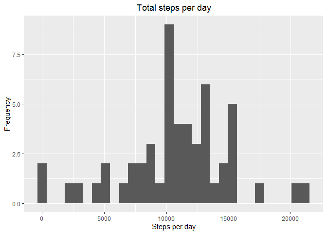
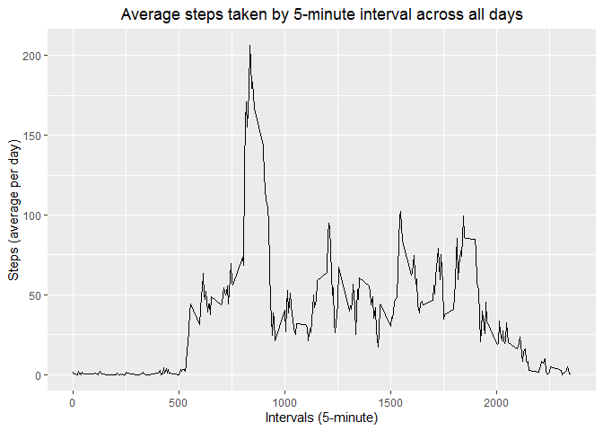
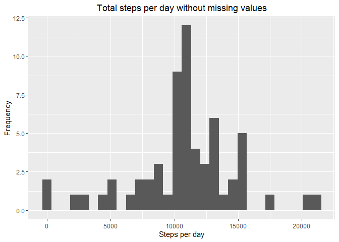
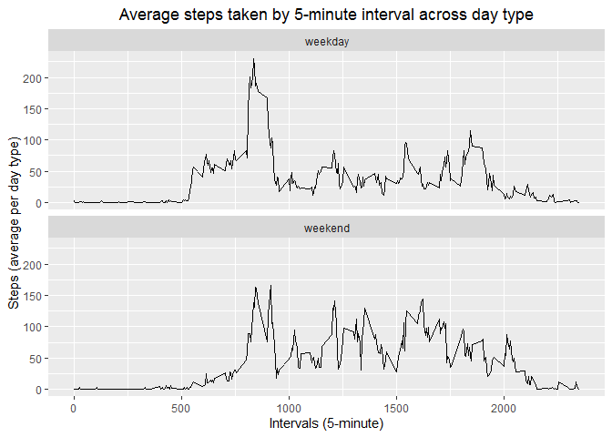

## Loading and preprocessing the data

```r
activity <- read.csv(unz("activity.zip",
                         "activity.csv"))
activity$date <- as.Date(activity$date,
                         "%Y-%m-%d")
```

## What is mean total number of steps taken per day?
#### Loading required libraries

```r
library(dplyr)
library(ggplot2)
```

#### 1. Calculating total number of steps taken per day

```r
stepsperday <- activity %>%
  group_by(date) %>%
  summarize(steps = sum(steps))
print(stepsperday, n = nrow(stepsperday))
```

```
## # A tibble: 61 x 2
##    date       steps
##    <date>     <int>
##  1 2012-10-01    NA
##  2 2012-10-02   126
##  3 2012-10-03 11352
##  4 2012-10-04 12116
##  5 2012-10-05 13294
##  6 2012-10-06 15420
##  7 2012-10-07 11015
##  8 2012-10-08    NA
##  9 2012-10-09 12811
## 10 2012-10-10  9900
## 11 2012-10-11 10304
## 12 2012-10-12 17382
## 13 2012-10-13 12426
## 14 2012-10-14 15098
## 15 2012-10-15 10139
## 16 2012-10-16 15084
## 17 2012-10-17 13452
## 18 2012-10-18 10056
## 19 2012-10-19 11829
## 20 2012-10-20 10395
## 21 2012-10-21  8821
## 22 2012-10-22 13460
## 23 2012-10-23  8918
## 24 2012-10-24  8355
## 25 2012-10-25  2492
## 26 2012-10-26  6778
## 27 2012-10-27 10119
## 28 2012-10-28 11458
## 29 2012-10-29  5018
## 30 2012-10-30  9819
## 31 2012-10-31 15414
## 32 2012-11-01    NA
## 33 2012-11-02 10600
## 34 2012-11-03 10571
## 35 2012-11-04    NA
## 36 2012-11-05 10439
## 37 2012-11-06  8334
## 38 2012-11-07 12883
## 39 2012-11-08  3219
## 40 2012-11-09    NA
## 41 2012-11-10    NA
## 42 2012-11-11 12608
## 43 2012-11-12 10765
## 44 2012-11-13  7336
## 45 2012-11-14    NA
## 46 2012-11-15    41
## 47 2012-11-16  5441
## 48 2012-11-17 14339
## 49 2012-11-18 15110
## 50 2012-11-19  8841
## 51 2012-11-20  4472
## 52 2012-11-21 12787
## 53 2012-11-22 20427
## 54 2012-11-23 21194
## 55 2012-11-24 14478
## 56 2012-11-25 11834
## 57 2012-11-26 11162
## 58 2012-11-27 13646
## 59 2012-11-28 10183
## 60 2012-11-29  7047
## 61 2012-11-30    NA
```

#### 2. Histogram of total number of steps taken each day

```r
qplot(data = stepsperday,
      steps,
      main = "Total steps per day",
      xlab = "Steps per day",
      ylab = "Frequency") +
    theme(plot.title = element_text(hjust = 0.5))
```

<!-- -->

#### 3. Mean and median of the total number of steps taken per day

```r
mean(stepsperday$steps, na.rm = TRUE)
```

```
## [1] 10766.19
```

```r
median(stepsperday$steps, na.rm = TRUE)
```

```
## [1] 10765
```

## What is the average daily activity pattern?
#### 1. Time series plot of 5-minute interval and average number of steps taken across days

```r
stepsperinterval <- activity %>%
  group_by(interval) %>%
  summarize(steps = mean(steps, na.rm = TRUE))

ggplot(data = stepsperinterval,
       aes(x = interval,
           y = steps)) + 
  geom_line() +
  labs(title = "Average steps taken by 5-minute interval across all days",
       x = "Intervals (5-minute)", 
       y = "Steps (average per day)") +
  theme(plot.title = element_text(hjust = 0.5))
```

<!-- -->

#### 2. Five-minute interval cointaining the maximum number of steps

```r
filter(stepsperinterval, steps == max(steps))
```

```
## # A tibble: 1 x 2
##   interval steps
##      <int> <dbl>
## 1      835  206.
```

## Imputing missing values
#### 1. Number of missing values in the dataset

```r
sum(is.na(activity$steps))
```

```
## [1] 2304
```

#### 2. Strategy for filling in all of the missing values
The strategy will be to impute the missing values with the mean for the same 5-minute interval.

#### 3. Creating a new dataset with the missing data filled in

```r
activityfilled <- activity

for (i in seq_len(nrow(activityfilled))){
    if (is.na(activityfilled[i, "steps"])){
        activityfilled[i, "steps"] <-
            stepsperinterval[
                stepsperinterval$interval ==
                  activityfilled[i, "interval"],
                "steps"]
    }
}
```

#### 4.1. Histogram of total steps taken each day without missing values

```r
stepsperdayfilled <- activityfilled %>%
  group_by(date) %>%
  summarize(steps = sum(steps))

qplot(data = stepsperdayfilled,
      steps,
      main = "Total steps per day without missing values",
      xlab = "Steps per day",
      ylab = "Frequency") +
    theme(plot.title = element_text(hjust = 0.5))
```

<!-- -->

#### 4.2. Calculating the mean and median of the total number of steps taken per day without missing values

```r
mean(stepsperdayfilled$steps)
```

```
## [1] 10766.19
```

```r
median(stepsperdayfilled$steps)
```

```
## [1] 10766.19
```


#### 4.3. Comparing the mean and median of the total number of steps taken per day with and without missing values

```r
mean(stepsperdayfilled$steps) -
  mean(stepsperday$steps, na.rm = TRUE)
```

```
## [1] 0
```

```r
median(stepsperdayfilled$steps) -
  median(stepsperday$steps, na.rm = TRUE)
```

```
## [1] 1.188679
```
As can be seen, there is no difference at all between the means of steps taken per day with or without missing values, and practically inexistent difference in the case of the medians.

#### 4.4. Impact of imputing missing data on the estimates of the total daily number of steps
In practical terms, imputing missing values causes no impact at all in the data as a whole.


## Are there differences in activity patterns between weekdays and weekends?
#### 1. Creating new factor variable for discriminating weekdays from weekend days

```r
activityfilled <- mutate(activityfilled,
                         days =
                           ifelse(
                             weekdays(date)
                             %in%
                             c("Saturday",
                               "Sunday",
                               "sábado",
                               "domingo"),
                             "weekend",
                             "weekday"))
```

#### 2. Time series plots of 5-minute intervals and average number of steps taken across weekdays and weekend days

```r
stepsperintervalfilled <- activityfilled %>%
  group_by(days, interval) %>%
  summarize(steps = mean(steps))

ggplot(data = stepsperintervalfilled,
       aes(x = interval,
           y = steps)) + 
  geom_line() +
  facet_wrap(days ~ ., nrow = 2, ncol = 1) +
  labs(title = "Average steps taken by 5-minute interval across day type",
       x = "Intervals (5-minute)", 
       y = "Steps (average per day type)") +
  theme(plot.title = element_text(hjust = 0.5))
```

<!-- -->
